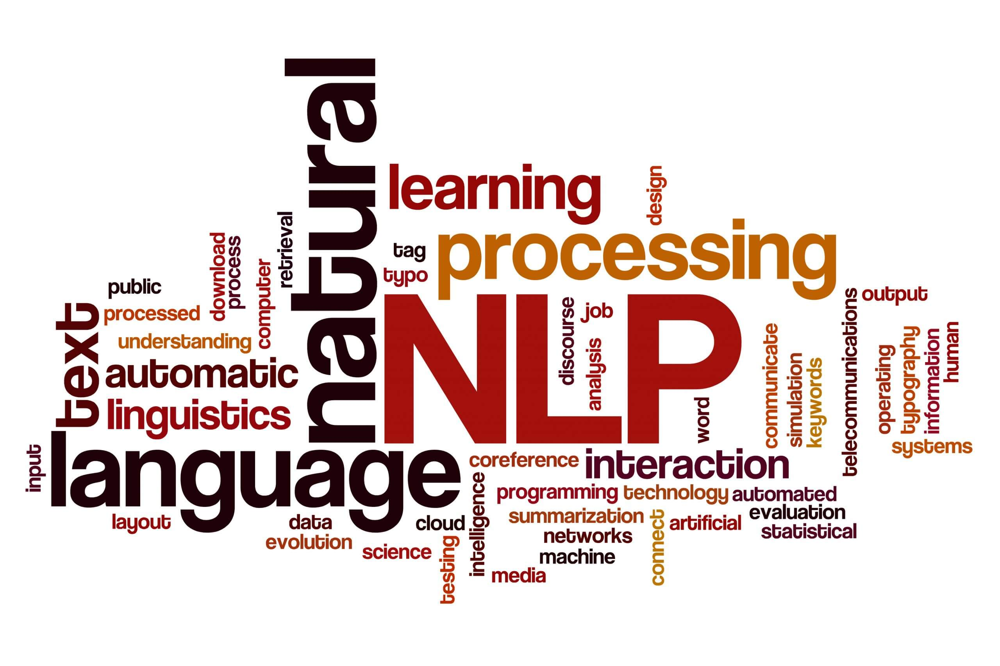

# Proyectos de Procesamiento de Lenguaje Natural

Una colección de proyectos de NLP que exploran conceptos fundamentales incluyendo vectorización de texto, word embeddings, modelos de lenguaje y traducción.

<p align="center">
  
</p>

## 📚 Descripción de Proyectos

### 1. Vectorización de Texto y Clasificación con Naive Bayes
**Archivo:** `Desafio_1.ipynb`

Implementación de técnicas de vectorización de texto y clasificación con Naive Bayes utilizando el clásico dataset 20 Newsgroups. Este proyecto explora:

- **Vectorización TF-IDF**: Conversión de documentos de texto en representaciones numéricas
- **Similitud de Documentos**: Cálculo de similitud coseno para encontrar documentos relacionados entre diferentes categorías de noticias
- **Clasificación Zero-Shot**: Construcción de un clasificador basado en prototipos que asigna etiquetas encontrando el documento de entrenamiento más similar
- **Optimización de Naive Bayes**: Comparación de MultinomialNB y ComplementNB con varios hiperparámetros para maximizar el F1-score
- **Word Embeddings desde TF-IDF**: Transposición de la matriz documento-término para analizar relaciones semánticas entre palabras

**Resultados Clave:**
- Se alcanzó un F1-score de 0.6862 usando ComplementNB con parámetros optimizados
- Se identificaron exitosamente clusters semánticos (ej: "god" → "jesus", "bible", "christ")

**Tecnologías:** scikit-learn, NumPy, pandas

---

### 2. Word Embeddings Personalizados con Word2Vec
**Archivo:** `Desafio_2.ipynb`

Creación de word embeddings específicos al contexto, entrenados en letras de canciones de Kanye West para capturar patrones de lenguaje y relaciones semánticas propias del artista.

- **Corpus Personalizado**: Entrenamiento de Word2Vec sobre letras concatenadas de múltiples archivos de canciones de Kanye West
- **Arquitectura Skip-gram**: Implementación de Word2Vec con vectores de 300 dimensiones
- **Análisis Semántico**: Exploración de similitudes y analogías entre palabras específicas al vocabulario del artista
- **Visualización**: Reducción de embeddings a 2D/3D usando t-SNE para exploración intuitiva
- **Insights Contextuales**: Descubrimiento de cómo palabras como "love", "pain" y "high" se relacionan de manera diferente en este corpus específico comparado con embeddings generales

**Insights Clave:**
- Palabras como "pain" se asocian con "women" y "deeper" en este contexto
- "Love" muestra connotaciones negativas (ej: "blame", "wronger") reflejando las temáticas líricas del artista
- Los embeddings específicos al contexto revelan espacios semánticos únicos

**Tecnologías:** Gensim, Word2Vec, scikit-learn, t-SNE, Plotly

---

### 3. Modelo de Lenguaje a Nivel de Caracteres
**Archivo:** `Desafio_3.ipynb`

Construcción y comparación de diferentes arquitecturas RNN para generación de lenguaje a nivel de caracteres, entrenado sobre artículos de noticias.

- **Comparación de Arquitecturas RNN**: Implementación y evaluación de modelos SimpleRNN, LSTM y GRU
- **Tokenización a Nivel de Caracteres**: Trabajo con caracteres individuales en lugar de palabras para generación de texto de grano fino
- **Métrica Perplexity**: Callback personalizado para medir la calidad del modelo usando perplexity sobre el conjunto de validación
- **Estrategias de Generación de Texto**:
  - Greedy search (determinístico, siempre elige el carácter más probable)
  - Beam search (mantiene los top-k candidatos)
  - Muestreo estocástico con control de temperatura (balancea creatividad y coherencia)
- **Análisis de Temperatura**: Exploración de cómo la temperatura afecta la diversidad de generación (0.5 = conservador, 1.5 = creativo)

**Desempeño del Modelo:**
- LSTM alcanzó perplexity de ~8.98 después de 8 epochs
- Generó texto coherente estilo noticias políticas
- Se demostraron exitosamente las ventajas y desventajas entre diferentes estrategias de generación

**Tecnologías:** TensorFlow/Keras, LSTM/GRU/SimpleRNN, NumPy, Matplotlib

---

### 4. Traductor Neuronal LSTM (Inglés-Español)
**Archivo:** `Desafio_4.ipynb`

Traductor automático neuronal sequence-to-sequence para traducción inglés-español utilizando PyTorch, implementando una arquitectura encoder-decoder con LSTM.

- **Arquitectura Encoder-Decoder**: Implementación de modelo seq2seq con unidades LSTM
- **Embeddings Pre-entrenados**: Uso de FastText embeddings (300 dimensiones) para el encoder de inglés
- **Diseño sin Attention**: Seq2seq clásico sin mecanismo de atención
- **Técnicas de Regularización**: Dropout (0.3), gradient clipping, gestión eficiente de memoria
- **Optimización de Memoria**: Uso de targets enteros sparse en lugar de one-hot encoding para reducir consumo de RAM
- **Inferencia Paso a Paso**: Traducción generativa con re-alimentación del decoder

**Resultados del Modelo:**
- Training accuracy: ~80% después de 30 epochs
- Validation accuracy: ~78-79%
- El modelo logra capturar relaciones semánticas básicas y estructuras gramaticales simples
- Traduce conceptos relacionados aunque no siempre de forma exacta

**Características Clave:**
- Dataset de 20,000 pares de oraciones inglés-español
- Maneja secuencias de longitud variable con padding
- Teacher forcing durante el entrenamiento
- Diseño independiente del dispositivo (soporta CPU, GPU, MPS)
- Sistema completo de tokenización y preprocesamiento
- Función de inferencia para traducción de nuevas oraciones

**Tecnologías:** PyTorch, NumPy, FastText embeddings, gdown

---

## 🛠️ Tecnologías y Herramientas

- **Frameworks de Deep Learning**: PyTorch, TensorFlow/Keras
- **Bibliotecas NLP**: Gensim, scikit-learn, NLTK
- **Procesamiento de Datos**: NumPy, pandas
- **Visualización**: Matplotlib, Seaborn, Plotly
- **Embeddings**: Word2Vec, GloVe

---

## 📦 Instalación

Crear un entorno virtual e instalar las dependencias:

```bash
# Crear entorno virtual
uv venv
source .venv/bin/activate  # En Windows: .venv\Scripts\activate

# Instalar dependencias
uv sync
```

---

## 🚀 Ejecutar los Proyectos

Cada proyecto está contenido en un notebook de Jupyter. Para ejecutar:

```bash
jupyter notebook
```

Luego abrir cualquiera de los archivos `Desafio_*.ipynb` o los notebooks de traducción.

---

## 📊 Datasets

- **20 Newsgroups**: Incluido vía scikit-learn
- **Letras de Canciones**: Canciones de Kanye West en `songs_dataset/`
- **Artículos de Noticias**: `news.csv` para modelo de lenguaje
- **Corpus de Traducción**: Corpus paralelo español-inglés (se descarga automáticamente)

---

## 🎯 Aprendizajes Clave

1. **Vectorización de Texto**: Comprensión de las ventajas y desventajas entre diferentes métodos de vectorización (TF-IDF, word embeddings, nivel de caracteres)
2. **Arquitecturas de Modelos**: Comparación de SimpleRNN, LSTM y GRU para tareas de modelado de secuencias
3. **Estrategias de Generación**: Exploración de greedy search, beam search y muestreo estocástico con temperatura
4. **Modelos de Traducción**: Implementación de modelos seq2seq end-to-end tanto en PyTorch como en TensorFlow
5. **Optimización**: Técnicas para prevenir overfitting y mejorar el desempeño del modelo

---

## 📄 Licencia

Este proyecto es parte del trabajo académico para un programa de Maestría en Ingeligencia Artificial.

---

## 👤 Autor

Ing. Danilo Reitano
