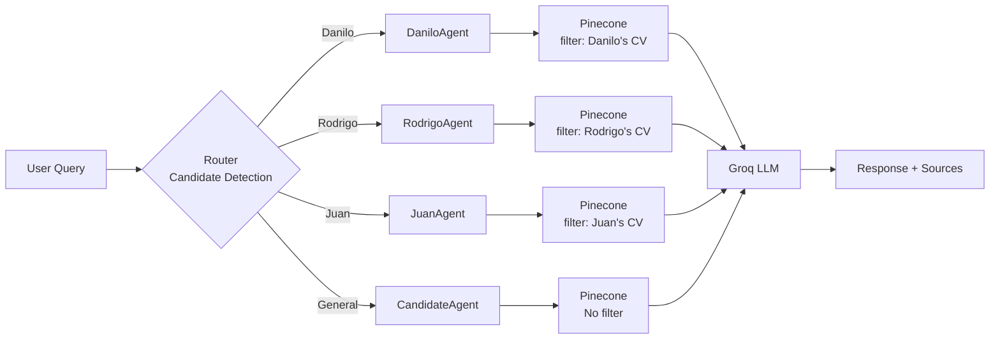

# TP3 - Multi-Agent CV Query System

A RAG chatbot with intelligent routing that automatically detects which candidate you're asking about and directs the query to a specialized agent.

## What It Does

This system extends TP2 by adding **multi-agent routing**:
- Detects which candidate is mentioned in your query (Danilo, Rodrigo, or Juan)
- Routes to a specialized agent that filters Pinecone results to that candidate's CV
- For general/comparative queries, uses a CandidateAgent that searches across all CVs
- Maintains conversation history for follow-up questions

**Key Difference from TP2**: Instead of searching all CVs for every query, TP3 intelligently filters by candidate, providing more focused and accurate responses.

## Setup

### Prerequisites
- Python 3.10+
- UV package manager
- Pinecone API key
- Groq API key
- **Existing Pinecone index with CVs** (run TP2 ETL first!)

### Installation

1. **Install Dependencies**:
   ```bash
   cd nlp-ejercicios/TP3
   uv sync
   ```

2. **Environment Variables**:
   Copy `.env.example` to `.env` and fill in your API keys.
   ```bash
   cp .env.example .env
   ```
   - `PINECONE_API_KEY`: Your Pinecone API key
   - `GROQ_API_KEY`: Your Groq API key
   - `PINECONE_INDEX_NAME`: Name of Pinecone index (default: `cv-rag-index`)

   **Note**: Use the same index name as TP2!

## Usage

### Run the Chatbot

```bash
streamlit run app.py
```

The application will open at `http://localhost:8501`.

### Example Queries

**Specific Candidate Questions:**
- "What is Danilo's professional experience?"
- "Tell me about Rodrigo's technical skills"
- "Where did Juan work previously?"
- "What about his education?" (follow-up question)

**Comparative/General Questions:**
- "Who has Python experience?"
- "Compare all candidates' backgrounds"
- "Which candidate has the most experience?"

**Tip**: Enable **Debug Mode** in the sidebar to see which agent handled each query.

## How It Works

### System Architecture



### Routing Logic

The system uses regex patterns to detect candidate mentions:

| Detected Patterns | Agent | Pinecone Filter |
|-------------------|-------|-----------------|
| "danilo", "reitano" | DaniloAgent | `Danilo_Reitano_CV.txt` |
| "rodrigo", "mesa" | RodrigoAgent | `Rodrigo_Mesa_CV.txt` |
| "juan", "garcia" | JuanAgent | `Juan_Garcia_CV.txt` |
| "who", "compare", "all" | CandidateAgent | All CVs |

### Agents

Each agent:
1. Filters Pinecone queries to specific CV(s)
2. Uses specialized system prompts
3. Maintains conversation history (last 8 messages)
4. Returns response with source citations

**Agents**:
- **DaniloAgent**: Answers about Danilo Reitano
- **RodrigoAgent**: Answers about Rodrigo Mesa
- **JuanAgent**: Answers about Juan Garcia
- **CandidateAgent**: General/comparative queries across all candidates

## Files

- `app.py`: Streamlit UI with agent routing visualization
- `agents.py`: Specialized agent query functions (dynamically created)
- `router.py`: Query routing and candidate detection logic
- `utils.py`: Shared utilities and candidate configuration
- `pyproject.toml`: Dependencies

## Configuration

### Adding New Candidates

The system is designed to scale easily. To add a new candidate, edit `utils.py` and add to `CANDIDATES_CONFIG`:

```python
CANDIDATES_CONFIG = {
    # ... existing candidates ...
    "maria": {
        "name": "Maria Lopez",
        "cv_file": "Maria_Lopez_CV.txt",
        "keywords": [r'\bmaria\b', r'\blopez\b']
    }
}
```

Then re-run the TP2 ETL to load the new CV. The system automatically creates the agent and routing logic!

## Troubleshooting

**Issue**: "Index not found" error  
**Solution**: Run TP2 ETL first to create and populate the Pinecone index

**Issue**: Wrong agent selected  
**Solution**: Use more specific candidate names (first or last name)

**Issue**: "No context found" responses  
**Solution**: Verify TP2 ETL loaded CVs with correct `.txt` filenames

**Issue**: Groq API errors  
**Solution**: Check your `GROQ_API_KEY` is valid and has quota

## Technical Details

### Models
- **Embeddings**: `sentence-transformers/all-MiniLM-L6-v2`
- **LLM**: `llama-3.3-70b-versatile` (Groq)

### Dependencies
- `streamlit`: Web UI
- `pinecone`: Vector database
- `sentence-transformers`: Embeddings
- `groq`: LLM API
- `python-dotenv`: Environment management

## Future Improvements

- **NLP-based detection**: Replace regex with NER or LLM-based candidate detection
- **Agent confidence scores**: Show how confident the router is about the candidate match
- **Cross-agent memory**: Remember information across different candidate queries
- **Multi-turn context switching**: Handle queries that mention multiple candidates
- **Query intent classification**: Detect question types (experience, skills, education, etc.)
- **Hybrid search**: Combine semantic and keyword search for better retrieval
- **Custom agent personalities**: Give each agent a unique response style
- **Voice interface**: Add speech-to-text for voice queries
- **Export conversations**: Save chat history to PDF or markdown
- **Analytics dashboard**: Track which candidates are asked about most

## Differences from TP2

| Feature | TP2 | TP3 |
|---------|-----|-----|
| **Architecture** | Single RAG endpoint | Multi-agent routing |
| **Query Handling** | Searches all CVs | Filtered by candidate |
| **Routing** | None | Intelligent candidate detection |
| **Agents** | 1 (implicit) | 4 specialized agents |
| **Conversation History** | Basic | With agent tracking |
| **Debug Info** | None | Shows routing decisions |

## License

Educational project for CEIA NLP course.
